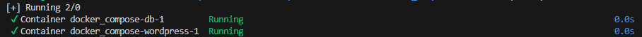
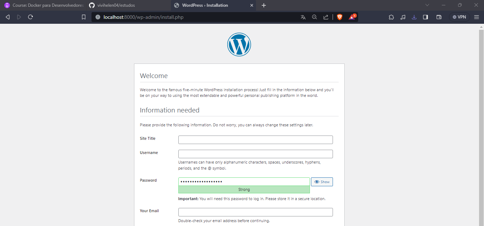

# Docker Compose

> O Docker Compose é uma ferramenta para rodar multiplos containers


- Feito em apenas um arquivo de configuração que orquestra a situação
- Uma forma de rodar múltiplos builds e runs com um comando

Cria-se um arquivo chamado docker-compose.yaml na raiz do projeto, ele vai coordenar os container e imagens.

### Executando o compose




### Parando o compose


### Redes no Compose

O Compose cria uma rede básica Bridge entre os containers da aplicação, porém pode-se isolar as redes com a chave networks, assim podemos conectar apenas os container que optarmos e definir diferentes drivers.

### Build no Compose

É possível fazer  o build de uma imagem no momento de execução do compose, indicando o diretório de build, no lugar de passar uma imagem pre-definida.

```jsx
services:
  db: 
    #image: mysql:5.7 #FROM mysql:5.7
    build: /mysql/
    volumes:
      - db_data:/var/lib/mysql
    restart: always
    env_file: 
      - config/db.env
    networks:
      - backend
```

### Volumes

Bind Mount
```jsx
wordpress:
    depends_on:
      - db
    image: wordpress:latest
    ports:
      - "8000:80"
    restart: always
    env_file: 
      - config/wordpress.env
    volumes:
      - diretoriolocal:/diretoriocontainer
```