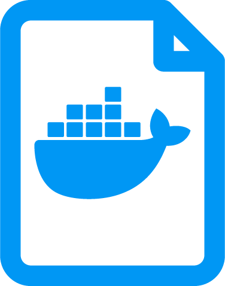

# Dockerfile

**O que é um Dockerfile?**

A forma de criar as nossas próprias imagens com as características necessárias para a aplicação funcionar. Basicamente é o arquivo de texto que descreve as etapas que o Docker precisa para preparar a sua imagem.

Para começar a construir uma imagem, eu preciso sempre ter uma outra imagem base, e nome dessa imagem base você pode pegar do docker hub.

**COMANDOS COMUNS**

**FROM** | nome da imagem base, de onde vem

**WORKDIR** | diretorio criado dentro da imagem para colocar os elementos da aplicação

**COPY** | pego o arquivo de configuração (se tiver) do diretorio local para a minha imagem

**RUN** | executa um código, como por exemplo, de instalação

**CMD** | passa as instruções necessárias para inicializar o container e afins

**EXPOSE** | expõe a aplicação em uma determinada porta

```docker
FROM node
WORKDIR /app
COPY package*.json .
RUN npm install
COPY . . //copia todos os caras importantes do src pro diretorio do container
EXPOSE 8080
CMD ["node", "server.js"]
```