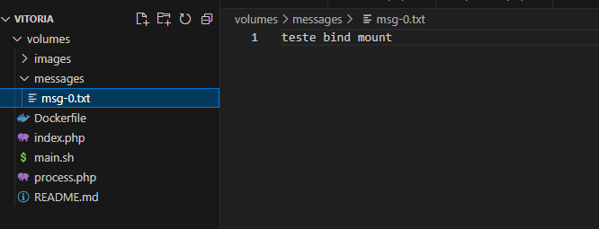

>Uma forma prática de persistir dados em aplicações e não depender de containers para isso, visto que todo dado criado por um container é salvo nele, quando o caontainer é removido perdermos os dados, então precisamos de volumes para gerenciar esses dados e fazer backups de forma simples.<

#### **Para essa prática, foi criado um formulário que permite adicionar uma mensagem**

#### **Aqui é possível ver que a criação da mensagem foi bem sucedida**

#### **Aqui foram criados os diferentes tipos de volume**

##### An^nimo

##### Named

##### Bind

