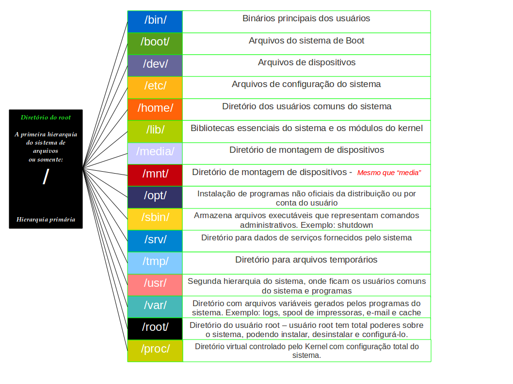

# LINUX FUNDAMENTAL

**Terminal:** É a interface/janelas que executa o Shell.

**Shell:** Linguagem que o terminal interpreta, reponsável por executar os comandos que ele envia.
**Sintaxe**: COMANDO -OPCOES DIRETORIOS/ARQUIVOS

**ESTRUTURAS DE ARQUIVOS LINUX:**



**COMANDOS**:

```bash
#TERMINAL
Crtl + Alt + T #ABRE O TERMINAL
Crtl + Shift + T #ABRE UMA NOVA JANELA NO TERMINAL
Ctrl + R #FAZ UMA PESQUISA REVERSA POR UM DETERMINADO ARQUIVO
```

```bash
#CD - SERVE PARA MUDAR DIRETÓRIOS

cd Directory #Entra em diretórios presentes no atual
cd / #Cai na raiz dos arquivos
cd /Directory/SubDirectory #Entra em diretório a partir de qualquer outro
cd .. #Volta um nível de diretório
cd ../../ #Volta mais de um nível de diretório
cd - #Volta pro último diretório que voce acessou
cd ~ #Acessa a home do usuário
cd ../../var #Volta diretorios e acessa outros específicos
cd +TAB #completa o diretório
cd directory && ls #entra em um diretório e lista o que tem nele
```

```bash
#LS - SERVE PARA LISTAR DIRETÓRIOS E ARQUIVOS

ls #lista todos os arquivos e pastas
ls -l #lista tudo com detalhes
ls -a #lista arquivos ocultos
ls -la #lista tudo com detalhes incluindo os ocultos
ls -lh #lista o tamanho ds arquivos em bytes
ls -ltr #ultima modificação do arquivo em forma crescente
ls -l /directory #lista arquivos de outro diretorio
ls -lr #mostra os arquivos em ordem reversa
ls -R #tudo o que tem nos subdiretorios
ls -lS #ordena pelo tamanho do arquivo
ls -m #lista os diretorios separados por virgula
```

```bash
#CAT - SERVE PARA CRIAR OU VER UM ARQUIVO 

cat file #exibe o conteudo do arquivo file
cat file file2 #exibe o conteudo de dois arquivos
cat file file2 > file3 #junta os dois arquivos em um só
cat -n file3 #exibe a lista de arquivos com as linhas numeradas
cat -e file #sinaliza o final de linha com $
cat file3 >> file #adiciona o conteudo do file3 no final do arquivo
```

```bash
#TOUCH - SERVE PARA CRIAR ARQUIVOS

touch nome_arquivo #cria um arquivo
touch nome_arquivo_existente #altera a data de alteração um arquivo existente
touch file1 file2 #cria varios arquivos
```

```bash
#OUTROS COMANDOS

man comando #retorna tudo sobre determinado comando (manual)
clear #limpa o terminal
```
